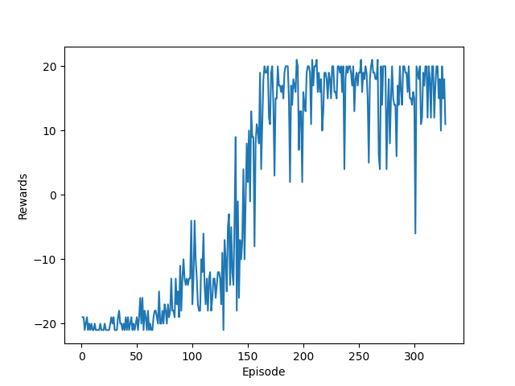
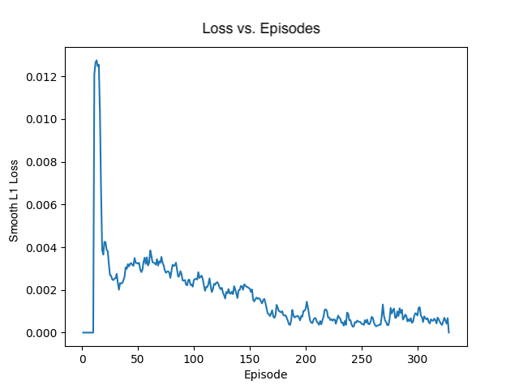

# spidey

This is a collection of experiments implementing a double-dueling Deep Q Learning Network with experience replay
inspired by DeepMind's papers. 

The AtariDQN folder contains architectures we tried to train to play Atari Pong. The Archive
folder contains unsuccessful attempts, while "Atari_env_final.py" is the working model. 

In addition to Pong, we are currently experimenting with training a DQN model to play an infinite vertical
platformer game "SpiderJump" that we created. We have not yet found a successful architecture/hyperparameter combination.
We believe this game is a challenge due to its infinite nature. If you wish to play SpiderJump yourself,
you can run "main.py" in the SpiderJumpGame file.

Pong Results
----
Using a learning rate of 0.0001, gamma of 0.99 and a batch size of 32 (for full list of hyperparameters see the 
'init_params()' method in 'Atari_env_final.py'), our model converged between 200-300 episodes. One episode is a full game
(first to 21 points). The reward is defined as (agent points - opponent points). Loss starts at 0 for the first few episodes
because the agent gathers sufficient memories first before starting to train. 

Human Demonstration of SpiderJump
----

How to Run
----
"Atari_env_final.py" and "Atari_wrappers.py" are the only files required to train Pong, as well as a weights.pt
file if you wish to save your weights after training. Install all packages listed across both files
normally, except cv2 (you should install opencv-python instead) and gym should be installed with atari 
(pip install 'gym[atari, accept-rom-license]').
